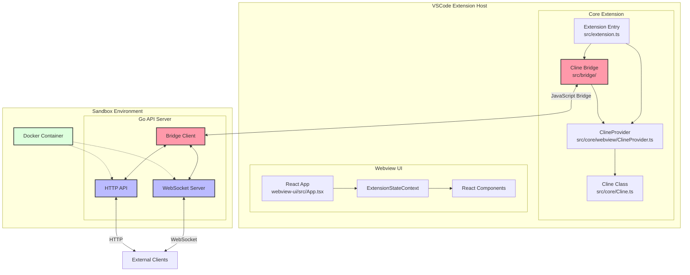
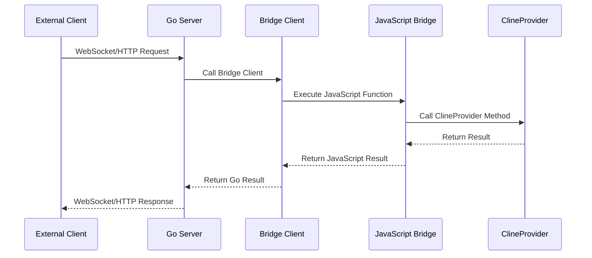
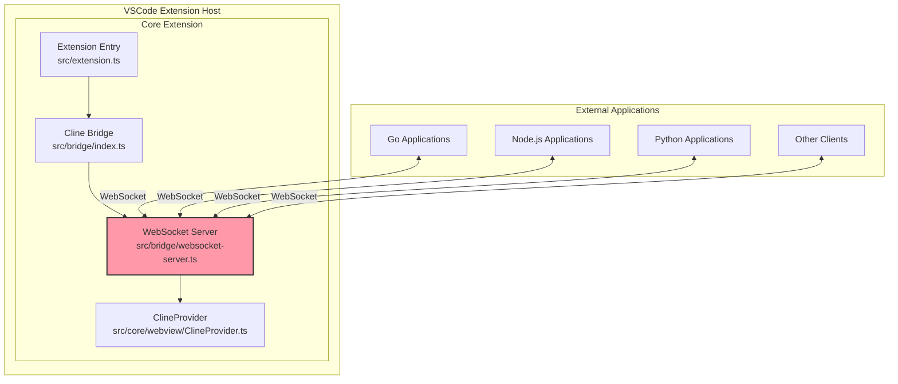

# Cline VSCode Extension with API Bridge

## Project Overview

The Cline VSCode Extension is a powerful AI assistant that helps developers with coding tasks directly within VSCode. The project has been enhanced with a bridge component that exposes the extension's functionality to external applications, specifically a Go API server running inside a sandbox Docker container environment.

This document provides a comprehensive overview of the Cline extension architecture with a focus on the newly added bridge functionality.

## Architecture Overview



## Bridge Architecture

The bridge architecture consists of two main components:

1. **VSCode Extension Bridge** (in `src/bridge/`):
   - Exposes the ClineProvider functionality to external applications
   - Registers VSCode commands that can be called by the bridge
   - Provides a JavaScript API for interacting with the extension

2. **Go API Server** (in `/Users/jannoszczyk/Documents/Github/frida/sandbox-client/`):
   - Runs in a sandbox Docker container
   - Provides WebSocket and HTTP endpoints for external clients
   - Communicates with the VSCode extension through the bridge

### Communication Flow



## VSCode Extension Bridge

### Bridge Registration

The bridge is registered in `src/extension.ts` during extension activation:

```typescript
// Register the Cline Bridge
registerClineBridge(context, outputChannel)
```

### Bridge Implementation

The bridge implementation consists of two main files:

1. **`src/bridge/index.ts`**: TypeScript module that registers VSCode commands and exposes the ClineProvider to the global scope.
2. **`src/bridge/cline_bridge.js`**: JavaScript module that provides functions for the Go server to call.

#### Key Functions in `index.ts`

- `registerClineBridge`: Registers VSCode commands and exposes ClineProvider to the global scope
- VSCode Commands:
  - `claude.initTask`: Initialize a new task
  - `claude.getGlobalState`: Get global state
  - `claude.getTaskWithId`: Get task by ID
  - `claude.initWithHistoryItem`: Initialize with history item
  - `claude.cancelTask`: Cancel current task
  - `claude.handleResponse`: Handle response
  - `claude.getState`: Get current state
  - `claude.updateApiConfig`: Update API configuration
  - `claude.updateInstructions`: Update custom instructions
  - `claude.toggleMode`: Toggle between plan and act modes

#### Key Functions in `cline_bridge.js`

- `getClineProvider`: Helper to get the ClineProvider instance
- `validateTaskId`: Validates that a task ID matches the current task
- Task Management:
  - `handleTaskInit`: Initialize a new task
  - `handleTaskResume`: Resume an existing task
  - `handleTaskCancel`: Cancel a task
  - `handleTaskResponse`: Handle a response to a task
- State Management:
  - `handleStateRequest`: Get the current state
  - `handleSettingsUpdate`: Update settings
  - `handleChatModeUpdate`: Update chat mode
- Authentication:
  - `handleAuthToken`: Set auth token
  - `handleAuthUser`: Set user info
  - `handleAuthSignout`: Sign out
- MCP (Model Context Protocol):
  - `handleMcpRequest`: Handle MCP requests
- Subscription:
  - `handleSubscribe`: Handle email subscription

## Go API Server (Sandbox Client)

The Go API server is located in `/Users/jannoszczyk/Documents/Github/frida/sandbox-client/` and provides a WebSocket and HTTP API for interacting with the Cline extension.

### Key Components

1. **Bridge Client** (`internal/cline/client.go`):
   - Communicates with the JavaScript bridge
   - Provides methods for task management, state management, etc.

2. **WebSocket Handler** (`internal/cline/handler.go`):
   - Handles WebSocket connections
   - Processes WebSocket messages
   - Manages active tasks

3. **HTTP API** (`internal/cline/api.go`):
   - Provides HTTP endpoints for task management
   - Registers routes with the HTTP server

### Message Types

The Go server defines several message types for WebSocket communication:

```go
// Message types for Cline WebSocket communication
const (
    TaskInit        = "task_init"
    TaskResume      = "task_resume"
    TaskCancel      = "task_cancel"
    TaskResponse    = "task_response"
    TaskStreamChunk = "task_stream_chunk"
    TaskStreamEnd   = "task_stream_end"
    StateRequest    = "state_request"
    StateUpdate     = "state_update"
    WebviewMessage  = "webview_message"
    SettingsUpdate  = "settings_update"
    ChatModeUpdate  = "chat_mode_update"
    AuthToken       = "auth_token"
    AuthUser        = "auth_user"
    AuthSignout     = "auth_signout"
    McpRequest      = "mcp_request"
    Subscribe       = "subscribe"
    Error           = "error"
)
```

### Bridge Client Implementation

The Bridge Client uses Node.js to execute JavaScript functions in the bridge:

```go
// Call executes a function in the JavaScript bridge with concurrency control
func (bc *BridgeClient) Call(function string, args ...interface{}) (map[string]interface{}, error) {
    // Acquire a semaphore slot
    bc.semaphore <- struct{}{}
    defer func() { <-bc.semaphore }()

    // Convert args to JSON
    argsJSON, err := json.Marshal(args)
    if err != nil {
        return nil, fmt.Errorf("failed to marshal arguments: %v", err)
    }

    // Build the command to execute the bridge function
    // In production, this would use a more efficient IPC mechanism
    // For now, we use Node.js to execute the bridge function
    cmd := exec.Command("node", "-e", fmt.Sprintf(`
        const bridge = require('%s');
        (async () => {
            try {
                const result = await bridge.%s(...%s);
                console.log(JSON.stringify(result));
            } catch (error) {
                console.error(JSON.stringify({success: false, error: error.message}));
                process.exit(1);
            }
        })();
    `, bc.bridgePath, function, string(argsJSON)))

    // Execute the command and get the output
    output, err := cmd.CombinedOutput()
    if err != nil {
        return nil, fmt.Errorf("bridge call failed: %v: %s", err, string(output))
    }

    // Parse the output
    var result map[string]interface{}
    if err := json.Unmarshal(output, &result); err != nil {
        return nil, fmt.Errorf("failed to unmarshal result: %v: %s", err, string(output))
    }

    // Check for success
    if success, ok := result["success"].(bool); !ok || !success {
        errorMsg := "unknown error"
        if msg, ok := result["error"].(string); ok {
            errorMsg = msg
        }
        return nil, fmt.Errorf("bridge call failed: %s", errorMsg)
    }

    return result, nil
}
```

### WebSocket Handler

The WebSocket handler processes messages from clients and calls the appropriate bridge functions:

```go
// processMessage processes a WebSocket message
func (h *Handler) processMessage(message []byte) ([]byte, error) {
    var msg WebSocketMessage
    if err := json.Unmarshal(message, &msg); err != nil {
        return nil, fmt.Errorf("failed to parse message: %w", err)
    }

    log.Printf("Received message type: %s", msg.Type)

    var response []byte
    var err error

    switch msg.Type {
    case TaskInit:
        response, err = h.handleTaskInit(msg)
    case TaskResume:
        response, err = h.handleTaskResume(msg)
    case TaskCancel:
        response, err = h.handleTaskCancel(msg)
    case TaskResponse:
        response, err = h.handleTaskResponse(msg)
    case StateRequest:
        response, err = h.handleStateRequest(msg)
    case SettingsUpdate:
        response, err = h.handleSettingsUpdate(msg)
    case ChatModeUpdate:
        response, err = h.handleChatModeUpdate(msg)
    case AuthToken:
        response, err = h.handleAuthToken(msg)
    case AuthUser:
        response, err = h.handleAuthUser(msg)
    case AuthSignout:
        response, err = h.handleAuthSignout(msg)
    case McpRequest:
        response, err = h.handleMcpRequest(msg)
    case Subscribe:
        response, err = h.handleSubscribe(msg)
    default:
        return nil, fmt.Errorf("unknown message type: %s", msg.Type)
    }

    return response, err
}
```

### HTTP API

The HTTP API provides endpoints for task management:

```go
// RegisterRoutes registers the API's routes with the given mux
func (a *API) RegisterRoutes(mux *http.ServeMux) {
    // WebSocket endpoint
    mux.HandleFunc("/api/cline/ws", a.handleWebSocket)

    // Task management endpoints
    mux.HandleFunc("/api/cline/tasks", a.handleTasks)
    mux.HandleFunc("/api/cline/tasks/", a.handleTaskByID)
}
```

## Integration Points

### VSCode Extension to Bridge

The VSCode extension integrates with the bridge through the `registerClineBridge` function in `src/extension.ts`:

```typescript
// Register the Cline Bridge
registerClineBridge(context, outputChannel)
```

### Bridge to Go Server

The Go server integrates with the bridge by executing JavaScript functions through Node.js:

```go
cmd := exec.Command("node", "-e", fmt.Sprintf(`
    const bridge = require('%s');
    (async () => {
        try {
            const result = await bridge.%s(...%s);
            console.log(JSON.stringify(result));
        } catch (error) {
            console.error(JSON.stringify({success: false, error: error.message}));
            process.exit(1);
        }
    })();
`, bc.bridgePath, function, string(argsJSON)))
```

## Security Considerations

The bridge implementation includes several security considerations:

1. **API Key Authentication**: The Go server requires an API key for authentication:
   ```go
   // Check API key for authentication
   apiKey := r.Header.Get("X-API-Key")
   if apiKey != h.apiKey {
       log.Printf("Unauthorized connection attempt with incorrect API key")
       http.Error(w, "Unauthorized", http.StatusUnauthorized)
       return
   }
   ```

2. **Task ID Validation**: The bridge validates that task IDs match the current task:
   ```javascript
   async function validateTaskId(provider, taskId) {
       try {
           const currentTaskId = await provider.getGlobalState("currentTaskId")
           return currentTaskId === taskId
       } catch (error) {
           console.error("Error validating task ID:", error.message)
           return false
       }
   }
   ```

3. **Concurrency Control**: The bridge client uses a semaphore to limit concurrent calls:
   ```go
   // Acquire a semaphore slot
   bc.semaphore <- struct{}{}
   defer func() { <-bc.semaphore }()
   ```

## WebSocket Bridge Server Implementation

The latest improvement to the bridge is a direct WebSocket server that runs inside the VSCode extension, eliminating the need for Node.js process execution and providing a more robust and efficient communication mechanism.

### Architecture

The WebSocket Bridge Server is implemented in `src/bridge/websocket-server.ts` and provides a direct WebSocket connection between external applications and the Cline extension. The server is started when the extension is activated and runs for the lifetime of the extension.



### Key Features

1. **Direct Communication**: Eliminates the need for Node.js process execution, providing a more direct and efficient communication channel
2. **Authentication**: Supports API key authentication for secure access
3. **Concurrent Connections**: Handles multiple client connections simultaneously
4. **Automatic State Updates**: Broadcasts state updates to connected clients periodically
5. **Health Monitoring**: Provides health check endpoints for monitoring server status
6. **Error Handling**: Robust error handling with appropriate client feedback

### Configuration

The WebSocket bridge server can be configured through VS Code settings:

```json
{
    "cline.bridge.enabled": true,
    "cline.bridge.port": 9000,
    "cline.bridge.apiKey": "your-secure-api-key"
}
```

### Message Types

The WebSocket bridge supports the following message types:

```typescript
export enum MessageType {
    TaskInit = "task_init",
    TaskResume = "task_resume",
    TaskCancel = "task_cancel",
    TaskResponse = "task_response",
    TaskStreamChunk = "task_stream_chunk",
    TaskStreamEnd = "task_stream_end",
    StateRequest = "state_request",
    StateUpdate = "state_update",
    WebviewMessage = "webview_message",
    SettingsUpdate = "settings_update",
    ChatModeUpdate = "chat_mode_update",
    AuthToken = "auth_token",
    AuthUser = "auth_user",
    AuthSignout = "auth_signout",
    McpRequest = "mcp_request",
    Subscribe = "subscribe",
    Ping = "ping",
    Error = "error"
}
```

### Example Client Code (Go)

```go
package main

import (
    "encoding/json"
    "fmt"
    "github.com/gorilla/websocket"
    "log"
    "net/url"
)

type Message struct {
    Type    string      `json:"type"`
    ID      string      `json:"id,omitempty"`
    TaskID  string      `json:"taskId,omitempty"`
    Payload interface{} `json:"payload,omitempty"`
}

func main() {
    u := url.URL{Scheme: "ws", Host: "localhost:9000", Path: "/"}
    
    // Add API key to query string
    q := u.Query()
    q.Set("apiKey", "your-secure-api-key")
    u.RawQuery = q.Encode()
    
    log.Printf("Connecting to %s", u.String())
    
    c, _, err := websocket.DefaultDialer.Dial(u.String(), nil)
    if err != nil {
        log.Fatal("dial:", err)
    }
    defer c.Close()
    
    // Send a ping message
    pingMsg := Message{
        Type: "ping",
        ID:   "1",
    }
    
    err = c.WriteJSON(pingMsg)
    if err != nil {
        log.Fatal("write:", err)
    }
    
    // Read response
    _, message, err := c.ReadMessage()
    if err != nil {
        log.Fatal("read:", err)
    }
    
    var response Message
    if err := json.Unmarshal(message, &response); err != nil {
        log.Fatal("unmarshal:", err)
    }
    
    fmt.Printf("Received: %+v\n", response)
}
```

## Future Improvements

While the WebSocket bridge provides a significant improvement over the Node.js process execution approach, there are still opportunities for further enhancements:

1. **Enhanced Security**: Implement more robust security measures, such as JWT authentication and HTTPS.
2. **Client Libraries**: Develop official client libraries for common languages like Go, Python, and Node.js.
3. **Performance Optimization**: Continue to optimize the bridge implementation for better performance, especially for high-frequency operations.
4. **Metrics and Monitoring**: Add metrics collection and monitoring capabilities to track usage and performance.
5. **Event Subscription**: Implement a more sophisticated event subscription model to allow clients to subscribe to specific event types.

## Deployment Considerations for Container Environments

When deploying the Cline VSCode Extension as a VSIX file in a VSCode server running in a container environment, several considerations must be addressed to ensure proper functionality:

### Path Resolution

The Go bridge client needs to locate the JavaScript bridge file (`cline_bridge.js`). In a containerized environment, paths must be correctly resolved:

```go
// Ensure bridge path is absolute
absPath, err := filepath.Abs(bridgePath)
if err != nil {
    log.Printf("Warning: Could not get absolute path for bridge path: %v", err)
    absPath = bridgePath
}
```

### Node.js Availability

The bridge implementation relies on Node.js to execute the JavaScript bridge functions. The container must have Node.js installed and available in the PATH:

```go
cmd := exec.Command("node", "-e", fmt.Sprintf(`
    const bridge = require('%s');
    (async () => {
        try {
            const result = await bridge.%s(...%s);
            console.log(JSON.stringify(result));
        } catch (error) {
            console.error(JSON.stringify({success: false, error: error.message}));
            process.exit(1);
        }
    })();
`, bc.bridgePath, function, string(argsJSON)))
```

### Extension Installation Location

When installed as a VSIX file, the extension will be located in the VSCode extensions directory. The Go server must be configured to find the bridge JavaScript file at the correct location:

```
/path/to/vscode-server/extensions/saoudrizwan.claude-dev-x.y.z/dist/bridge/cline_bridge.js
```

Where `x.y.z` is the version of the extension.

### ClineProvider Availability

The bridge relies on the `ClineProvider` being available in the global scope. This is ensured by the `registerClineBridge` function in `src/extension.ts`:

```typescript
// Expose ClineProvider to global scope for bridge.js to access
// @ts-ignore - Intentionally adding to global scope
global.ClineProvider = ClineProvider
```

### Retry Mechanism

The Go client implements a retry mechanism with exponential backoff to handle transient failures, which is particularly important in containerized environments where network conditions may be less stable:

```go
// CallWithRetry executes a function in the JavaScript bridge with retries
func (bc *BridgeClient) CallWithRetry(maxRetries int, retryDelay time.Duration, function string, args ...interface{}) (map[string]interface{}, error) {
    // Implementation with exponential backoff and jitter
}
```

### Concurrency Control

The bridge client uses a semaphore to limit concurrent calls, preventing overload in resource-constrained container environments:

```go
// Acquire a semaphore slot
bc.semaphore <- struct{}{}
defer func() { <-bc.semaphore }()
```

### Container Configuration

To ensure proper integration, the container should be configured with:

1. **Volume Mounting**: The VSCode extensions directory should be mounted to make the extension accessible
2. **Network Configuration**: Proper network configuration to allow WebSocket connections
3. **Environment Variables**: Required environment variables like `API_AUTH_TOKEN` should be set
4. **Resource Allocation**: Sufficient CPU and memory resources for Node.js processes

### Integration Testing

Before deploying to production, thorough integration testing should be performed to verify:

1. The Go server can locate and execute the JavaScript bridge
2. WebSocket connections are established correctly
3. Task management functions work as expected
4. Authentication and security measures are effective

## Conclusion

The Cline VSCode Extension with API Bridge provides a powerful way to expose the extension's functionality to external applications. The bridge architecture allows for seamless integration with a Go API server running in a sandbox Docker container environment, enabling new use cases and workflows for the Cline extension.

When deployed in a containerized environment, proper attention to path resolution, Node.js availability, and container configuration will ensure the bridge functions correctly. The built-in retry mechanisms and concurrency control provide robustness in less stable network conditions typical of containerized deployments.
