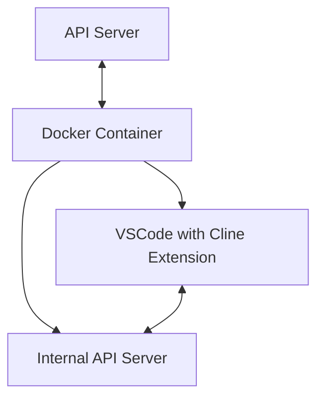

# System Patterns

## System Architecture

The system follows a containerized architecture with the following components:

### Key Components

1. **API Server**
   - Serves as the communication bridge to the Docker container
   - Manages authentication and authorization via API keys
   - Routes requests to the appropriate Docker container
   - Handles error cases and retries

2. **Docker Container**
   - Isolated environment running VSCode with the Cline extension
   - Contains an internal API server that communicates with VSCode
   - Provides a secure execution environment for code generation and execution

3. **VSCode with Cline Extension**
   - The core Cline functionality running in a headless VSCode instance
   - Executes AI-driven coding tasks within the container
   - Accesses files and resources only within its container

## Design Patterns

### 1. API Gateway Pattern
The API server acts as a gateway, abstracting the complexity of the underlying Docker container and VSCode instance. It provides a simplified, consistent interface for interaction.

### 2. Containerization Pattern
Each user's environment is isolated in a Docker container, providing security and resource management. This pattern allows for easy scaling and deployment.

### 3. Proxy Pattern
The internal API server within the Docker container acts as a proxy between the external API and the VSCode extension, translating HTTP requests into extension commands.

## Error Handling Strategy

1. **Network Resilience**
   - Retry logic for API requests
   - Configurable timeouts
   - Alternative mirrors for package downloads

2. **Container Recovery**
   - Health checks to detect container issues
   - Automatic restart of failed containers
   - State preservation across restarts
