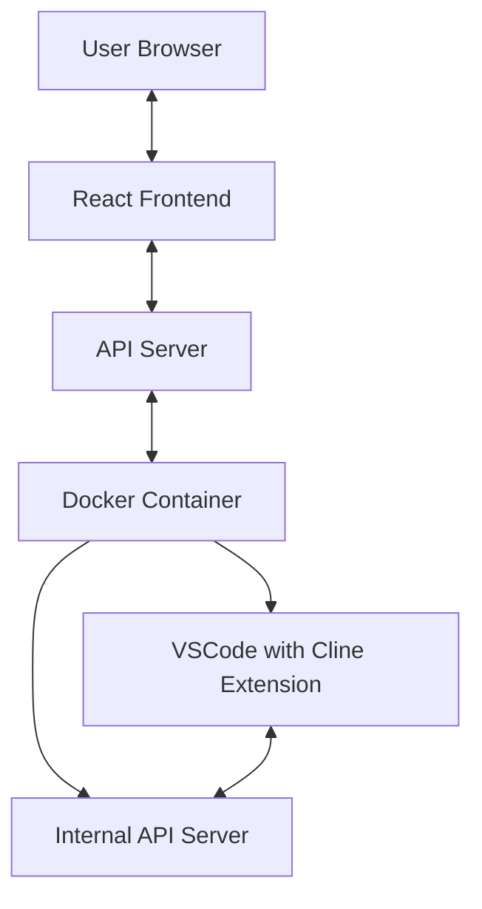

# System Patterns

## System Architecture

The system follows a containerized microservices architecture with the following components:



### Key Components

1. **React Frontend (moved to cline-frontend-private)**
   - Web-based UI that replicates the Cline VSCode extension interface
   - Communicates with the API server to send tasks and receive responses
   - Handles user authentication and session management

2. **API Server**
   - Serves as the communication bridge between the frontend and the Docker container
   - Manages authentication and authorization via API keys
   - Routes requests to the appropriate Docker container
   - Handles error cases and retries

3. **Docker Container**
   - Isolated environment running VSCode with the Cline extension
   - Contains an internal API server that communicates with VSCode
   - Provides a secure execution environment for code generation and execution

4. **VSCode with Cline Extension**
   - The core Cline functionality running in a headless VSCode instance
   - Executes AI-driven coding tasks within the container
   - Accesses files and resources only within its container

## Design Patterns

### 1. API Gateway Pattern
The API server acts as a gateway, abstracting the complexity of the underlying Docker container and VSCode instance. It provides a simplified, consistent interface for the frontend to interact with.

### 2. Containerization Pattern
Each user's environment is isolated in a Docker container, providing security and resource management. This pattern allows for easy scaling and deployment.

### 3. Proxy Pattern
The internal API server within the Docker container acts as a proxy between the external API and the VSCode extension, translating HTTP requests into extension commands.

### 4. State Management Pattern
The system maintains state across different components:
- Frontend state: Managed in React context/state
- API server state: Tracks active sessions and containers
- Container state: Maintains the VSCode workspace and file system

### 5. Authentication Pattern
API key-based authentication is used throughout the system to secure communication between components.

## Component Relationships

### Frontend to API Communication
- RESTful HTTP requests with API key authentication
- JSON payloads for task submission and responses
- Polling mechanism for status updates

### API to Docker Communication
- Container management through Docker API
- HTTP requests to the internal API server
- Volume mounting for persistent storage

### Internal API to VSCode Communication
- Direct extension API calls within the container
- File system access for code generation and execution
- Command execution for terminal operations

## Data Flow

1. **Task Submission Flow**
   ```mermaid
   sequenceDiagram
       User->>Frontend: Submit task
       Frontend->>API Server: POST /api/tasks
       API Server->>Docker Container: Forward task
       Docker Container->>VSCode Extension: Execute task
       VSCode Extension->>Docker Container: Return results
       Docker Container->>API Server: Return response
       API Server->>Frontend: Return task status
       Frontend->>User: Display results
   ```

2. **Command Execution Flow**
   ```mermaid
   sequenceDiagram
       Frontend->>API Server: Request command execution
       API Server->>Docker Container: Forward command
       Docker Container->>VSCode Extension: Execute in terminal
       VSCode Extension->>Docker Container: Return output
       Docker Container->>API Server: Return command result
       API Server->>Frontend: Return output
   ```

## Error Handling Strategy

1. **Network Resilience**
   - Retry logic for API requests
   - Configurable timeouts
   - Alternative mirrors for package downloads

2. **Container Recovery**
   - Health checks to detect container issues
   - Automatic restart of failed containers
   - State preservation across restarts

3. **User Feedback**
   - Clear error messages in the UI
   - Status indicators for long-running operations
   - Fallback options when operations fail
